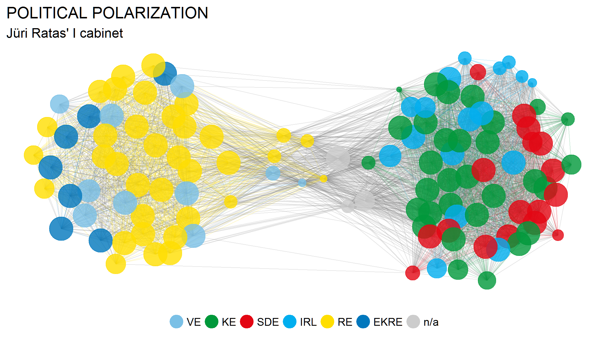

# riigikogu

`riigikogu` is an R package for accessing voting related data from the Chancellery of the Riigikogu's [open data API](https://api.riigikogu.ee/swagger-ui.html).



## Installation

Use the `devtools` package to install the development version from Github:

```
devtools::install_github("tanelp/riigikogu", dependencies=TRUE)
```

## Examples

### General information about votings

```
start_date = "2016-11-23"
end_date = "2019-04-29"
votings = get_votings(start_date, end_date)
head(votings[, c(1, 6:12)])

                                  uuid present absent inFavor against neutral abstained type.code
1 1a021b93-c629-4c2b-99ce-15f77596bfc3      95      6      86       0       0        15    AVALIK
2 69310ecf-e571-465c-9c6e-e3483cfa1d60      96      5       8      41       0        52    AVALIK
3 c89af9ab-c5e3-4af9-8235-d8a7cc9262f5      95      6      78       0       0        23    AVALIK
4 8dada26e-f3df-4a2b-8c6b-cc4814a351a6      95      6      82       1       4        14    AVALIK
5 f42b7258-a053-42d9-8076-b9420a8b5d56      91     10      89       0       1        11    AVALIK
6 a75c580d-29a4-4511-baed-21fe534111fa      96      5      50      44       0         7    AVALIK
```

### Individual votes

```
uuid = "1a021b93-c629-4c2b-99ce-15f77596bfc3"
votes = get_votes(uuid)
head(votes[, c(1, 2, 10)])

                                  uuid         fullName decision.code
1 bec6cb23-f13e-411b-9393-a3e4fb59378b        Raivo Aeg         POOLT
2 764a05b8-221d-4b65-b87b-a9b1f8b569fa       Jüri Adams EI_HAALETANUD
3 90074aa2-4938-41a9-8275-3a6efa1cee31     Yoko Alender         POOLT
4 01e6473e-8d4d-4b94-9266-0e5082e94942     Andres Ammas         POOLT
5 586335bd-0e3f-4cee-a325-7af602224ca7 Vladimir Arhipov        PUUDUB
6 ed14baf6-eddf-46f6-bff2-21503139d1ec       Krista Aru         POOLT
```

### Political polarization visualization

Each member is drawn as a single node. Edges are drawn between members who agree above a set threshold value of votes.

This code produces a similar graph shown in the beginning of the document.

```
start_date = "2016-11-23"
end_date = "2019-04-29"

votings = get_votings(start_date, end_date)
votings = filter(votings, type.code == "AVALIK")

votes_list = lapply(votings$uuid, get_votes)
has_no_votes = sapply(votes_list, is.null)
votes_list = votes_list[!has_no_votes]

nodes = get_nodes(votes_list)
edges = get_edges(nodes, votes_list)

visualize_network(nodes, edges, prob=0.7)
```
